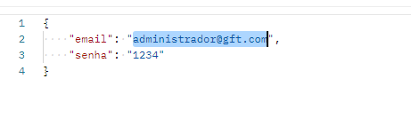
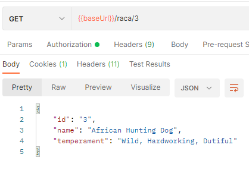

# Desafio de API -Atendimento Veterinário

### Configuração:

- Foi utilizado nesteprograma o JDK 17.

- O Spring Tools Suítes4 como IDE de produção.

- Para a comunicação com o Banco de Dados foi utilizado o FlyWay para realizar a migração.

- Foi utilizado oSecurity sob o auxilio do JWT 4.0

- E para criação dosEndpoints foi o utilizado Postman

  - [OBESERVAÇÃO] - Foi configurado o Swaggerporem abortei a tentativa de documenta-lo porque não consegui resolver o pontoda autorização através do token, porem foi utilizado as dependências Swagger2.10.5 e o Springdoc-openapi

- E para realizar ostestes  foi utilizado o Junit4 e oMockito 4.0.

### Como Iniciar oprojeto

- Para autenticar o token para obter acesso as Endpoints 

  1 - O programa automaticamente irá criar um usuárioadministrador o qual será utilizado para realizar o primeiro acesso.

  2 -  acessar com o e-mail (administrador@gft.com) e a senha("1234") 

      

    

      [OBSERVAÇÃO] -Infelizmente não consegui criar a logica para realizar a autentificarão dosdados somente a ação no controller

  3 - Os usuários serão criados juntamente como registro do cliente ou medico e não ira permitir a mesma chave que no caso éo e-mail.

## Regras para adicionare extrair informações

- Passos para iniciaro programa da maneira correta

  - Os pets só serão criados se tiver um cliente valido, então o registro do mesmo depende dos BD de cliente, não consegui verificar antes da entrega que houve um erro de logica,  e  o primeiro registro de cliente deve ser criado com o atributo pet como "null"

  - Os endereços serão criados dentro dos endpoints de cliente e medico, e será armazenado de maneira individual

  - Ao invés de colocar o atributo como "raça"adicionei como "espécie" e a mesma que esta consumindo da API the dog ira adicionar o nome da raça automaticamente através do ID, como cliente também

  

        

   

- E para auxiliar foi criado o endpoint de nome "ConsumindoAPI" , para buscar todos ou por nome os tipos de raça e temperamento dos pets.

  

        

        

    

# Sobre os testes

- Foi realizado ametodologia TDD somente com as entidades após não consegui realiza-lo

- Então foi feita uma coberturade 40% do código apenas

 

